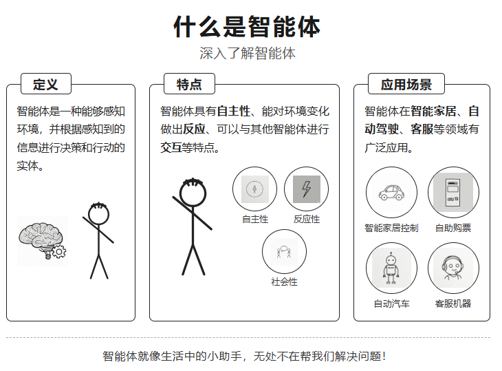

# 火柴人风格知识卡片（stick-figure-knowledge-card）

把扣子（Coze）工作流「火柴人风格知识卡片」转成的 WorkBuddy 技能 / 智能体。

## 用法
对话里给一个名称 / 概念，例如：
- 「生成一张『光合作用』的火柴人知识卡片」
- 「把『什么是智能体』做成小黑人风格卡片」
技能会自动：① 写图像提示词 → ② 竖版 9:16 出图。

## 与原扣子工作流的对应关系
| 扣子节点 | 本技能实现 |
|---------|-----------|
| 开始（input） | 用户输入的名称 |
| 图片提示词（豆包·1.5·Pro·32k，systemPrompt=知识卡片设计师） | SKILL.md 中的角色与布局指令，由对话大模型生成图像提示词 |
| 图像生成（model=10，1440×2560，ddim_steps 25，guidance 2.5） | 本环境文生图 / ImageGen，竖版 9:16 |
| 结束（output=图，output1=提示词） | 展示图和提示词 |

## 说明
- 原工作流的图像生成节点带一张风格参考图（什么是智能体.jpg，权重 0.7）。Coze 专属图像模型与参考图在本环境不可用，已用文字把「黑白线条 + 淡蓝点缀的手绘火柴人科普风」写进提示词来等效还原风格。
- 原始节点 JSON 见 `references/coze-source.md`。
